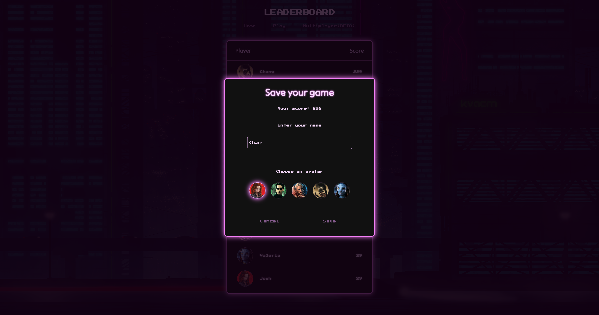
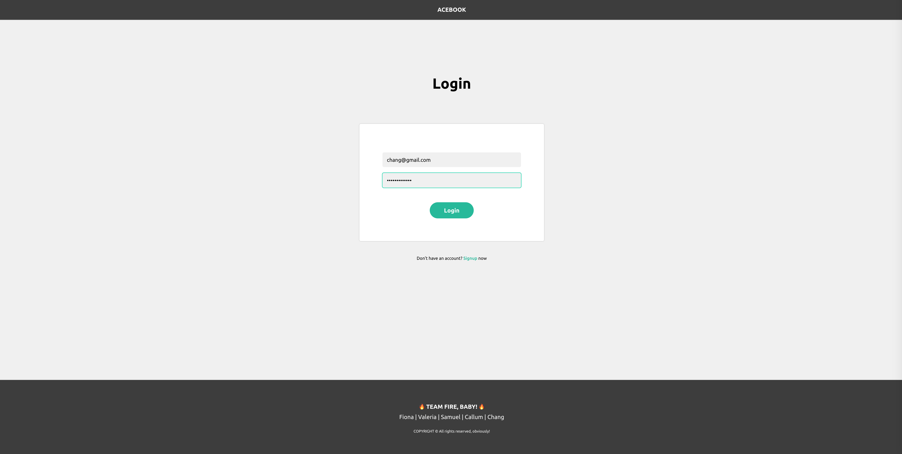
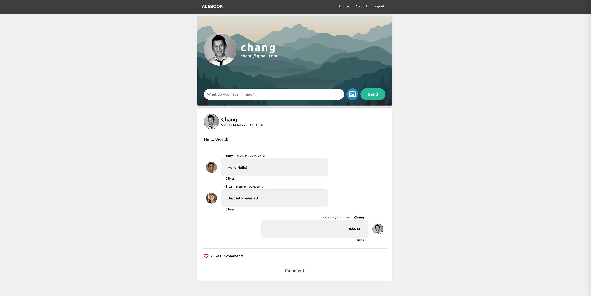
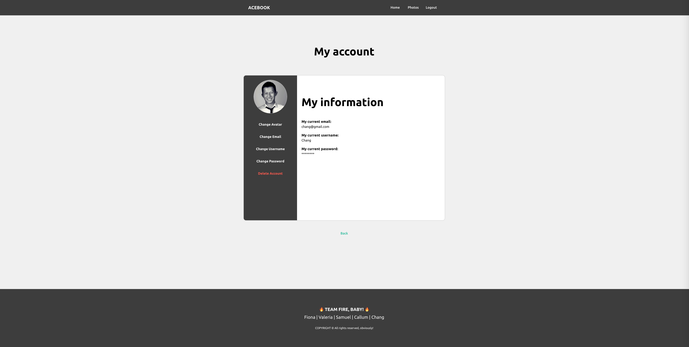

# Chang Huynh
## { Software Engineer }

<!-- 

 -->

I am a passionate and dedicated software engineer with a strong emphasis on teamwork and a deep love for coding.   

I thrive on tackling complex challenges head-on. I am known for my ability to break down problems and find innovative solutions.

Keeping up with the latest industry trends is crucial to me, and I continuously strive to expand my knowledge and skills.

I am excited to contribute to a dynamic and innovative tech community where Ican leverage my skills to work on cutting-edge projects. With a growth mindset and an insatiable curiosity, I am ready to take on new challenges, learn from mypeers, and make a meaningful impact.

[Projects](#projects) | [Tech Experience](#tech-experience) | [Skills](#skills) | [Work Experience](#work-experience) | [Education](#education) | [Hobbies](#hobbies)
---

# { PROJECTS }

## > YAHTZEE_
An adaptation of the classic dice game set in a cyberpunk universe.

 <!--  -->
 
 <!--  -->
 

_Technologies used: React, MondoDB, Express, Node.JS, CSS, Jest, Cypress, Cakewalk, Helm, Synth1_

 

## > ACEBOOK_
A light version of the facebook application.

 <!--  -->
 
 
 <!--  -->

_Technologies used: React, Node.Js, MongoDB, Express, CSS, Jest, Cypress_

 

## > NEWS SUMMARY_
A web app showcasing The Guardian's top 10 headlines through a keyword search feature.

_Technologies used: JavaScript, HTML, CSS, Jest_

## > MAKERSBnB_
A clone of the AirBnB application.

_Technologies used: Ruby, Sinatra, PostgreSQL, Rspec_

<!-- | Name                         | Description | Tech/tools |
| ---------------------------- | ------------ | ------------------------------------- |
| Yahtzee game | An adaptation of the classic dice game set in a cyberpunk universe | React, MondoDB, Express, Node.JS, CSS, Jest, Cypress, Cakewalk, Helm, Synth1 |
| Acebook | A light version of the facebook application  | React, Node.Js, MongoDB, Express, CSS, Jest, Cypress |
| News Summary | A web app showcasing The Guardian's top 10 headlines through a keyword search feature | JavaScript, HTML, CSS, Jest | 
| MakersBnB | A clone of the AirBnB application | Ruby, Sinatra, PostgreSQL, Rspec | -->

---

# { TECH EXPERIENCE }

###### January-May 2023 (London, UK)
## MAKERS ACADEMY
### Software Engineer Bootcamp

Makers Academy is a prestigious coding bootcamp known for its immersive and collaborative learning environment.   
A 16 weeks curriculum emphasising teamwork and collaboration through pair programming and engineering projects to consistently deliver high-quality code and solutions.

#### Full-Stack Development
- Planning and organising a full-stack project.
- Designing the software architecture.
- Building both front-end and back-end components of web applications.
- Defining endpoints and making HTTP requests.
- Working with databases.
- Performing unit-tests, integration tests and end-to-end tests (e2e).
- Conducting code reviews for quality and adherence to coding standards.
- Problem-solving and debugging.
- Deploying and maintaining the software solution.

#### Technologies
- **Frontend**: JavaScript, React, HTML, CSS, Ruby, ERB
- **Backend**: Node.JS, Express, Ruby, Sinatra
- **Database**: MongoDB, Mongoose, PostgreSQL, SQL
- **Testing**: Rspec, Jest
- **Version Control**: git, github
- **Dev tools**: PostMan, TablePlus, Jira, Trello

#### Methodologies and Practices
- Object-Oriented Programming (OOP)
- Test-Driven Development (TDD)
- Behaviour-Driven Development (BDD)
- Model-View-Controller (MVC)
- Agile, Extreme Programming (XP)

 

## UDEMY CERTIFICATIONS
- React, the complete guide - May 2023
- JavaScript unit-testing with Jest and Vitest - April 2023
- Testing Ruby with Rspec: The Complete Guide - Feb 2023
- The Linux Command Line Bootcamp - Feb 2023
- Learn to code with Ruby - Sept 2022
- The complete JavaScript course - oct 2020
- Advanced CSS and SASS - oct 2020
- Modern HTML/CSS (including SASS) - sept 2020

<!-- ##### Collaborated in a highly collaborative environment: 
- Makers Academy places a strong emphasis on pair programming and effective communication.
- Actively engaged in pair programming, working closely with fellow students to solve problems efficiently, communicate ideas, share knowledge and improve coding skills to deliver high-quality code.

##### Practiced Agile/XP methodologies: 
- Working within an Agile/XP framework allowed me to adapt quickly, collaborate effectively, and deliver value in iterative development cycles.
- Actively participated in daily stand-up meetings, where we discussed progress, challenges, and planned the day's work.
- Contributed to creating and refining user stories, prioritizing tasks, and organizing project backlogs.

##### Applied Test-Driven Development (TDD) and practiced OOP:
- Gained a strong understanding of Test-Driven Development (TDD) principles and regularly employed it in my coding practices. 
- By writing tests before implementing functionality, I ensured the quality and reliability of my codebase.
- Applied Object-Oriented Programming (OOP) concepts to design and structure my code in a modular and maintainable way.

##### Implemented Model-View-Controller (MVC) architecture:
- Gained a solid understanding of the MVC pattern and its benefits in building scalable and maintainable applications.
- Learned to separate concerns by designing clear models for data management, implementing views for user interfaces, and creating controllers to handle business logic and user interactions.
- Applying MVC allowed me to organize code effectively, enhance code reusability, and improve the overall structure and modularity of my projects.

##### Technical Skills and Tools:
- HTML, CSS, Javascript
- MongoDB, Express, React, Node.js
- Ruby, Sinatra
- Rspec, Jest, Cypress -->

---

# { SKILLS }

#### Teamwork
- Strong collaborative skills through engaging in pair programming and group projects at the Software Engineer Bootcamp.
- Excel in working effectively in diverse teams, valuing different perspectives and contributing to a positive team dynamic.

#### Communication
- Demonstrated Excellent verbal and written communication skills through team projects during the Software Engineer Bootcamp.
- Proficient in conveying complex technical concepts to both technical and non-technical stakeholders.

#### Problem-Solving
- Natural aptitude for breaking down complex problems into manageable components.
- Performance-oriented mindset, prioritising solutions that account for factors such as time complexity and scalability.
- Continuously refine problem-solving skills through programming exercise platforms such as CodeWars and CoderBytes.
- Excel in maintaining composure and focus under pressure, keeping productivity and problem-solving effective.

#### Growth Mindset
- Embrace challenges as opportunities for personal growth and professional development.
- Embrace feedback and constructive criticism to foster improvement.
- Proactivaly participated in code reviews sessions assessed by experienced professionals.
- Consistently seeking opportunities for self-improvement by maintaining curiosity and a thirst for knowledge.

#### Continuous Learning
- Genuine enthusiasm for learning new technologies and staying up-to-date with industry trends.
- Recently completed Udemy certifications in React, JavaScript testing, Ruby testing, and The Linux Command Line Bootcamp, among others.

<!-- #### Full Stack Development
- Proficient in building full-stack web applications using modern frameworks and technologies such as React, Node.js, MongoDB and Express.
- Experience with front-end development using HTML, CSS, and JavaScript.

#### Test-Driven Development (TDD)
- Experience with writing test cases and using testing frameworks like RSpec, Jest, and Cypress to ensure code quality and functionality.
- Understanding of the importance of TDD in producing reliable and maintainable code.

#### Agile Methodologies
- Familiarity with Agile/XP practices such as Scrum and Kanban.
- Experience working in iterative development cycles, delivering incremental features and adapting to changing requirements.

#### Continuous Learning
- Enthusiasm for learning new technologies and staying up-to-date with industry trends.
- Recently completed Udemy certifications in React, JavaScript unit-testing with Jest and Vitest, Testing Ruby with RSpec, and The Linux Command Line Bootcamp, among others.
- Utilizing the knowledge gained from these certifications to enhance my development skills and deliver high-quality code.

#### Communication
- Excellent verbal and written communication skills developed through my work experience and team projects during the Software Engineer Bootcamp.
- Proficient in conveying complex technical concepts to both technical and non-technical stakeholders.

#### Teamwork
- Strong collaborative skills fostered through pair programming and group projects at the Software Engineer Bootcamp.
- Experience working effectively in diverse teams, valuing different perspectives and contributing to a positive team dynamic.

#### Hard Work
- Demonstrated dedication and perseverance in completing challenging projects and meeting deadlines.
- Willingness to put in the extra effort to learn and improve coding skills.

#### Self-Control
- Ability to stay calm and focused under pressure, maintaining productivity and problem-solving effectively.
- Adaptability and resilience in navigating complex technical challenges. -->

---

# { WORK EXPERIENCE }

###### 2019 to present
## Casino Inspector
**Playboy Club/Metropolitan Mayfair**

- Developed strong attention to detail, analytical skills, and problem-solving abilities.
- Monitored casino games to ensure compliance with gaming regulations, rules, and procedures.
- Enforced game rules, procedures, and betting limits to maintain game integrity.
- Collaborated with surveillance teams to identify and investigate any irregularities or potential violations.
- Resolved customer complaints and disputes related to gaming activities.

<!-- - Responsible for dealing and inspecting casino games such as American Roulette, Baccarat, BlackJack and Three Card Poker.
- Developed excellent attention to detail and strong observation skills to ensure fair play and maintain game integrity.
- Enhanced communication and customer service skills by interacting with diverse clientele. -->

<!-- The role of a Gaming Inspector requires quick thinking, attention to detail, and the ability to handle complex situations effectively.  
These skills translate well into the field of software engineering, where problem-solving, attention to detail, and communication with team members are vital. -->

###### 2016-2019
## Casino dealer
**Empire Casino** - *2017-2019* 
**Aspers Casino Newcastle** - *2016-2017*

- Developed strong interpersonal and communication skills, essential for collaboration and effective team coordination.
- Dealt various casino games, including blackjack, poker, and roulette, ensuring smooth gameplay and accurate payouts.
- Enforced game rules and procedures, ensuring fair play and game integrity.
- Provided exceptional customer service by assisting players, answering inquiries, and resolving issues.

<!-- - Performed dealer duties, ensuring accurate gameplay and adherence to casino regulations.
- Enhanced customer service and interpersonal skills by providing an exceptional gaming experience for patrons.
- Demonstrated proficiency in managing multiple tasks simultaneously and maintaining composure in fast-paced environments.
- Developed a high level of concentration, focus, and mental agility to manage multiple game tables.
- Developed a strong sense of teamwork and collaboration with colleagues.

- Transferable skills:  
The position of a Dealer requires strong concentration, focus, and the ability to handle complex tasks efficiently  
which align with the demands of software engineering, where attention to detail, problem-solving, and efficient task management are essential.  
The experience gained in managing various responsibilities and working effectively with a team can be applied to collaborative software development projects. -->

###### 2012-2015
## Store Manager
**Tel and Com**

- Developed strong leadership and management skills, fostering a positive work environment.
- Managed daily operations of a retail store, including inventory management, sales, and customer service.
- Led a team of sales associates, providing training, guidance, and performance evaluations.
- Utilized problem-solving skills to address customer concerns and optimize store operations.
- Coordinated with suppliers and maintained relationships with key stakeholders.

 
<!-- - Oversaw the daily operations of a retail store, including inventory management, staff supervision, and customer service at Tel and Com.
- Developed leadership, organizational, and problem-solving skills in a fast-paced retail environment.
- Gained experience in managing resources and meeting targets while maintaining a positive work culture.

- Transferable skills:  
As a Store Manager, you acquired valuable leadership, organizational, and problem-solving skills.   
These skills are transferable to software engineering, where managing projects, leading teams, and finding efficient solutions are integral to success. -->

###### 2010-2012
## Sales Assistant
**Tel and Com**

- Assisted customers with product inquiries, recommendations, and purchases.
- Developed product knowledge and sales techniques to drive revenue.
- Provided excellent customer service, ensuring a positive shopping experience.
- Developed strong communication and interpersonal skills, crucial for effectively communicating technical concepts.

<!-- - Provided sales assistance, customer support, and product knowledge in a retail setting at Tel and Com.
- Developed excellent communication and interpersonal skills through interactions with customers.
- Learned to work effectively in a team and prioritize tasks efficiently.

- Transferable skills:  
As a Sales Assistant, you developed strong communication and interpersonal skills, which are crucial for collaborating with team members,   
understanding user requirements, and effectively communicating technical concepts in the software development process. -->

---

# { EDUCATION }

## 2023 - MAKERS ACADEMY - London, UK
### Software Engineer Graduate

- Full-stack web development skills, including front-end and back-end technologies.
- Proficiency in programming languages such as Ruby and JavaScript.
- Understanding of software development best practices, including version control and testing.
- Problem-solving and critical thinking skills developed through coding challenges.
- Collaboration and teamwork abilities gained from working on engineering projects.

## 2016 - CERUS CASINO ACADEMY - Manchester, UK
### Casino Dealer Graduate

- Developed interpersonal and communication skills from dealing with casino patrons.
- Developed strong attention to detail and accuracy in managing and calculating bets.
- Ability to work under pressure and maintain composure in a fast-paced environment.
- Customer service skills, including resolving conflicts and providing a positive experience for customers.
- Adaptability and flexibility in handling different casino games and rules.

## 2010 - TROYES UNIVERSITY - France
### BTEC HND Business Management
###### UK equivalent for the french BTS Management des Unités Commerciales

- Understanding of management principles.
- Sales and negotiation abilities.
- Project management skills and the ability to organize and coordinate teams.
- Presentation and communication skills for delivering reports and presentations.

## 2006 - JACQUES AMYOT HIGH SCHOOL - France
### A-LEVEL Economics and Social Sciences
###### UK equivalent for the french Baccalauréat Economique et Social

- Foundation in economics principles and market dynamics.
- Foundation in social sciences and their impact on society.

---

# { HOBBIES }

